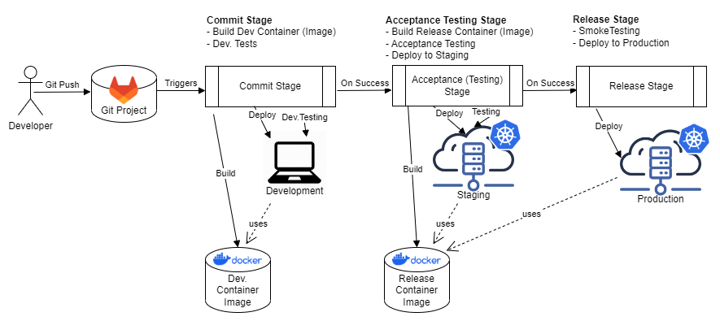

# CI/CD Strategy

# General Thoughts on CI/CD for this Project
The CI/CD strategy of this project is strongly influenced by the approach presented in the following book:

*Humble, Jez, and David Farley. "Continuous Delivery: Reliable Software Releases through Build." Test, and Deployment Automation. Addison-Wesley (2010)*

# CI/CD Pipeline Strategy of this Project
This projects uses a GitLab CI pipeline. The code and detailed implementation can be found directly in the [code](../../.gitlab-ci.yml). 
This only givers an overview of the basic ideas and concepts.

For this project, we distinguish the following: 

## 2 Build Artifacts
A build artifact in this project refers to a Docker container in which the application code is deployed. It contains all dependencies that the application needs. 
We distinguish two types of build artifacts in this project. They are described in the following: 

**Development Container Image** 

Container image that can be used for development as well as testing in the **Commit**-stage
- It contains all dependencies necessary for application development.
- This includes the whole content of the repository and all dependencies needed for application testing e.g. unit testing. 
- This image is used for local development and in the **Commit**-Stage of the CI/CD Pipeline. 
- The dockerfile describing the image can be found [here](../../infra/build_artifacts/development.dockerfile)

**Release Container Image**

Container image that can be used for production roll-out. 
- The container image is production hardened, meaning it contains bare minimum for production
- This means it does NOT including testing code and other dependencies that are not not required for a production deployment. 
- The reason for keeping it to a bare minimum artifact is decreased potential security problems and higher performance. 
- This image is used in the **Acceptance Testing**, **Non-Functional Testing**, and **Release**-Stage of the CI/CD Pipeline. 
- The dockerfile describing the image can be found [here](../../infra/build_artifacts/release.dockerfile)

## 2 Environments

**Production - PROD** 

This is the environment where the application is actually put into operation for their intended uses by end users.
The environment consists of a the following parts:

Only release containers will be deployed into the production environment. As these containers are specifically hardened for usage by end-users.  

For obvious reasons, there is only one instance of this environment.
It is not possible to have multiple production environments at the same time. 

**Staging - STAGING** 

Environment in wich acceptance testing is being performed.
These tests include both functional tests (test if features of the application work properly) as well as non-functional testing (e.g. performance and security testing). 

The setup is as similar to production as possible in order to be able to find problems of the application that may occur in production already in this environment. 

As this environment is supposed to be as similar as possible to production, only release containers will be deployed into it.

Due to resource limitations, there is also only one instance of this environment. All deployments that shall go to production, have to go through this single instance of the environment.

## 3 Pipeline Stages

For more information about GitLab stages see [GitLab Doc](https://docs.gitlab.com/ee/ci/yaml/#stages).
A GitLab stage refers to a certain conceptual comprehensive stage in the CI/CD pipeline (e.g. acceptance testing, non-functional testing). Each of the stages contains general tasks.

See examples directly in the GitLab CI pipeline [code](../../.gitlab-ci.yml).

**Commit** 

The commit stage asserts that the system works at the technical level. 
- It executes a suite of automated tests, language checks, and runs code analysis.
- Is intended to give fast feedback to developers. 
- Executed for all branches!
- Provisions a new development environment for every run. 

**Acceptance Testing** 

Automated acceptance test stages assert that the system works at the functional, that behaviorally it meets the needs of its users and the specifications of the customer.
- Deploys, tests, and executes the application in the staging environment.
- Executed for Merge Requests and Master-branch

**Release**

Release stage delivers the system to users by deploying it into the production.
- Only executed for Master-branch

