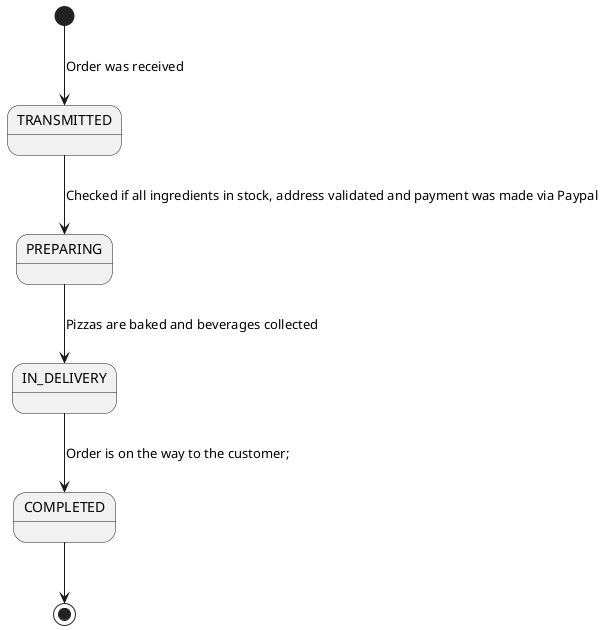

# Domain Model 
The following is a domain model, that defines and describes domain entities. 

**Please acknowledge** that the presented structure is an internal view on the application. In some cases domain entities may differ in how they are exposed through the REST-endpoint. This is due to the fact, that exposing internal data structures to external system is an anti-pattern which leads do bad maintainability **Source to be added**. 


# Domain Model (Draft for Future Vision; certainly going to change)
```plantuml
class Beverage {
   stock: Int
   price: Float
}

class Dough {
   stock: Int
   price: Float
}

class Topping {
   stock: Int
   price: Float
}

class OrderBeverageQuantity {
   quantity: Int
}

class Pizza {
}

class PizzaTypeToppingQuantity {
  quantity: Int
}
class Order {
  order_datetime: datetime
  orderStatus: Enum
  paypal_order_id: Str
}
class PizzaType {
  name: Str
  pricing: Float
}
class User {
  username: Str  
}
class SpecialWishPizza{
  cold: Bool
}
class FavoritePizza{
}
class Address{
    house_number: Int
    street: Str
    validated: Bool
    last_name: Str
}
class Sauce{
    stock: Int
    price: Float
}
Pizza "*" -- "1" PizzaType : is of >
PizzaType "1" -- "*" SpecialWishPizza : is of type <
PizzaType "1" -- "*" FavoritePizza : is of type <
PizzaType "*" --- "1" Dough
PizzaType "*" --- "1" Sauce
'PizzaType "*" --- "*" Topping


together {
   'PizzaType "*"--"*" Topping : contains >
   'PizzaType "*"--"1" Dough : contains >
   'PizzaType "*"--"1" Sauce : contains >
   'Topping "*" -- "1" Pizza : contains <
   '(Pizza, Topping) . PizzaTypeToppingQuantity   
   'Pizza "*"--"1" PizzaType : is of > 
}

Beverage "*" - "*" Order : contains <
(Beverage, Order) . OrderBeverageQuantity

PizzaType "*" -- "*" Topping : contains >


(PizzaType, Topping) ...left. PizzaTypeToppingQuantity
'Pizza "*" - "1" Order : contains <
Order "*" - "*" Pizza : contains >
Order "*" - "1" Address : contains >
User "1" - "*" Order : contains <
User "*" - "1" SpecialWishPizza : has >
User "*" - "1" FavoritePizza : has >

'Notes
note "Tomato\nCurry" as noteSauceType
note "Italian Style\nWhole Grain" as noteDoughType
note "Salami\nHam" as noteToppingType
note "Tonno\nHawaii" as notePizzaType
note "Coca Cola Zero\nFanta" as noteBeverageType

'Map Notes
Sauce .. noteSauceType
Dough .. noteDoughType
Topping ..  noteToppingType
PizzaType .. notePizzaType
Beverage .. noteBeverageType
```



# Description of Domain Entities
This is a quick overview of the domain entities:
- **PizzaType** - represents a certain type of pizza that is on the menu, e.g. *Pizza Hawaii*, *Pizza Diavolo*, *Pizza Veggie Lovers*
- **Pizza** - represents a specific pizza that is ordered, produced, shipped, and eaten, e.g. the specific pizza that was ordered by **User** *S. Ruehl* and is currently being produced. 
- **User** - represents a user of the system, e.g. *m.roth*
- **Sauce** - represents a sauce for a **PizzaType**, e.g. *tomato sauce*
- **Dough** - represents a dough for a **PizzaType**, e.g. *wheat dough*
- **Topping** - represents a topping for a **PizzaType**, e.g. *salami*, *cheese*
- **PizzaTypeToppingQuantity** - associates a specific topping to a **PizzaType** and specifies the quantity, e.g. the pizza made by *S. Ruehl* today contains 10 *salami*, 5 *ham* and 5 *mushrooms*
- **Order** - a specific order a **User** placed, e.g. *S. Ruehl* ordered a *Pizza* of type *Veggie Lovers* and a *Beverage* of type *Gude Bier*
- **Beverage** - a certain type of beverage that is on the menu, e.g. *Coca-Cola Zero*, *Coca-Cola*, *Pepsi*, *Gude Bier*.
- **OrderBeverageQuantity** - associates a specific beverage to an order and specifies the quantity, e.g. the order made by *S. Ruehl* today contains 2 *Coca Cola Zero* and 1 *Fanta*
- **Address** - represents the delivery address of an *Order*, e.g. *Schöfferstraße 8, 64295, Darmstadt, Michael, Roth etc.*
- **SpecialWishPizza** - lets a *User* compose his pizza according to his wishes, e.g. *cold* pizza
- **FavoritePizza** - lets a *User* save his favorite pizza

Notation hint:
- Domain entities are marked **bold**
- Instances of domain entities are marked *italic*
