# Local Development Setup

## Requirements

- **Docker:** https://docs.docker.com/engine/install/
- **Docker Compose V2 (not docker-compose):** https://docs.docker.com/compose/install/

## PyCharm environment setup

Start Pycharm and open the cloned project in PyCharm.     
If you get a popup about a tool called *Poetry* you may cancel the popup.

### Setup docker service in PyCharm

Open settings of PyCharm and go to *Build, Execution, Deployment->Docker->Tools*
and check *Use Compose V2*.

Go back to *Build, Execution, Deployment->Docker* and press the add button to add a new docker service:

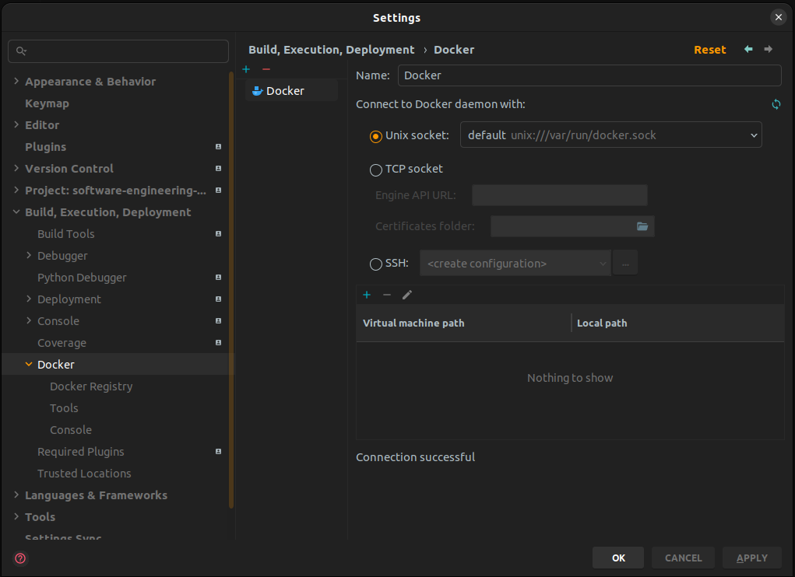

Close the settings. Open the service tab in the bottom line of PyCharm. You should now see your new docker service, select it and run it by the the play button on the left side to see the service with Containers, Images etc.

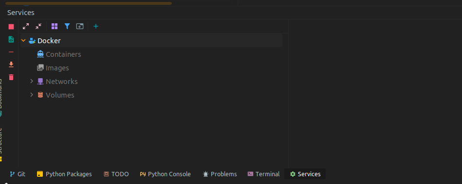

### Configure docker compose file as python interpreter

Open the settings again and go to *Project: software-engin...->Python Interpreter*. Select *Add Interpreter* and choose *On
Docker Compose*.

**Important:** You have to select the *docker-compose-pycharm.yml* file. This is a specific docker-compose file for PyCharm (see picture). 
The pre-selected file *docker-compose.yml* is not going to work!

To change the config file, select the folder icon for *configuration files* and use the + und - icons to configure the docker-compose file with **pycharm** in its name (you will find it in the root folder of your project).

Select *web* in the Service Checkbox and press the next button.

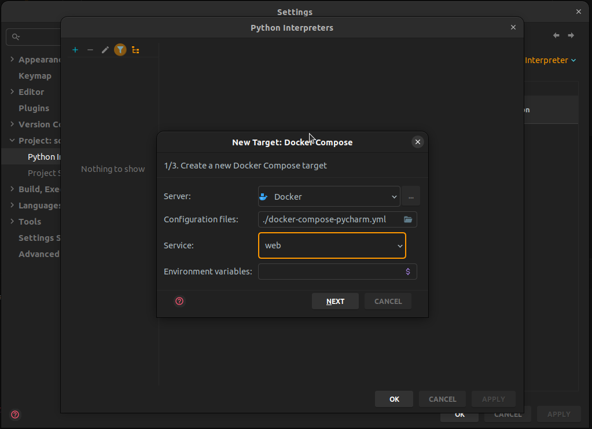

This will download and build all the images that are required by the docker-compose file. When the process is done, press next again:

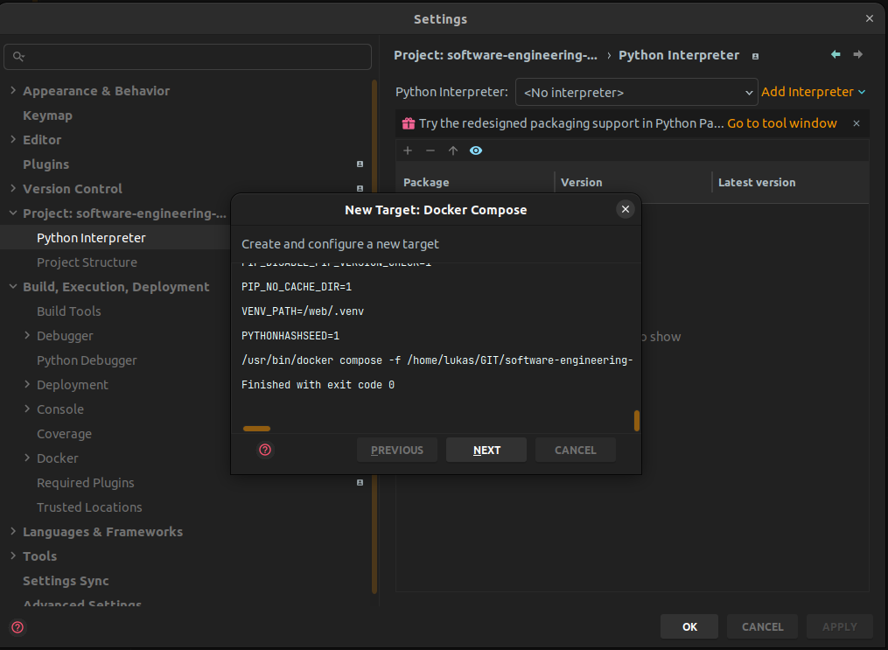

PyCharm should now have automatically found a python interpreter in */web/.venv/bin/python3*:

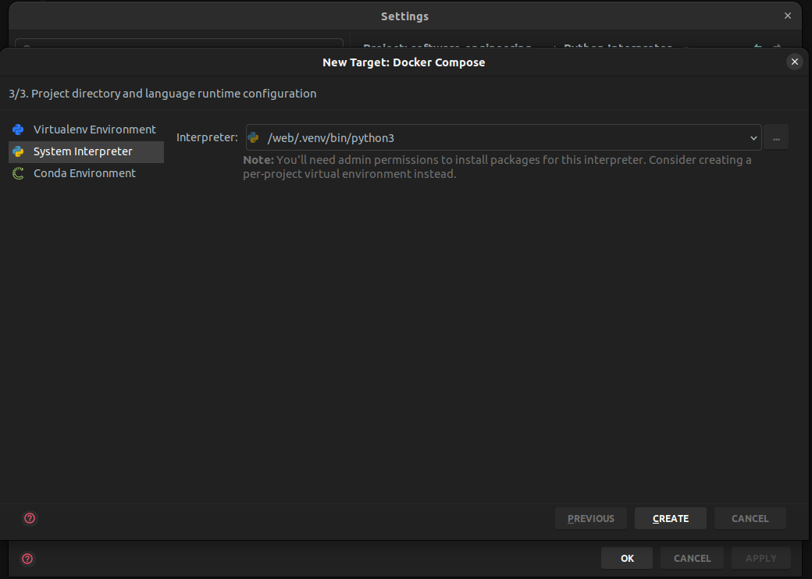

Finish the process with the create button and close the settings. After that, you should see the text "python interpreter" in the right corner of the bottom line of PyCharm:

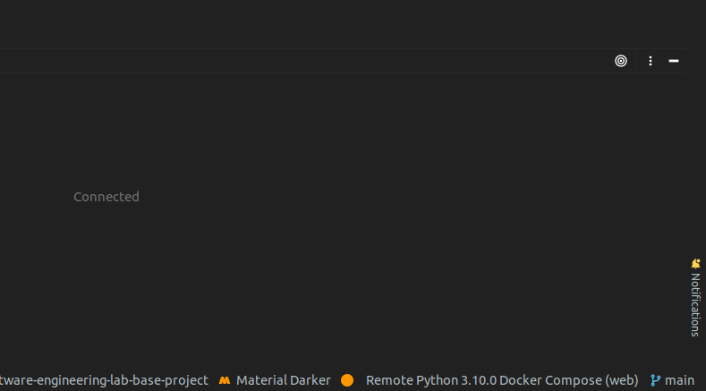

### Run/debug the app

Open *app/main.py* and run the main function by pressing the play/debug button:

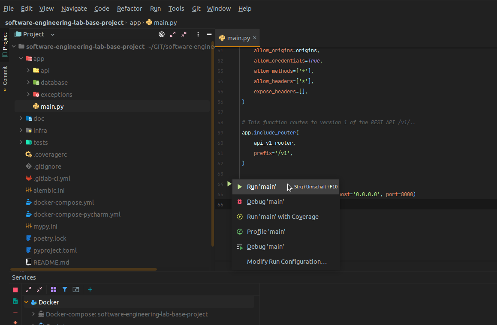

You should now see something like in the picture. 

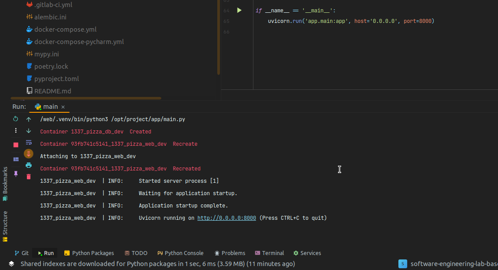

Open http://localhost:8000/docs. If you see the API Backend your local setup is nearly done.

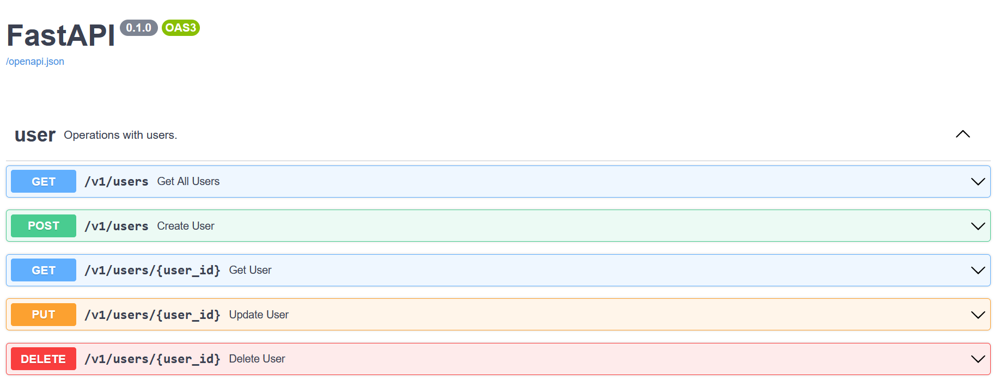

### Database migration

You just created a new database container that contains a database server and an _empty_ database, 
but not the database schema that your application needs. 
So, you need to set up the appropriate database using a migration.

To migrate the database in the PyCharm setup, you connect to the container and 
open a terminal window (of the container). In this window you execute
the alembic migration command. 

In the lower bar, open the Service tab to see the docker service. From the *web*-services select the container *1337_pizza_web_dev*
and choose *Create Terminal* in the context menu (see picture):

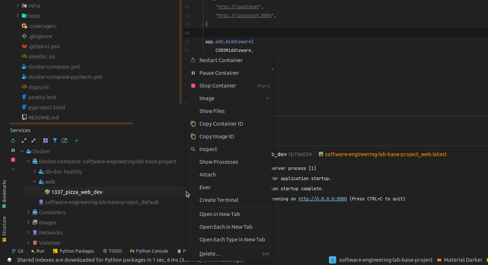

Type

```
cd /web
PYTHONPATH=. alembic upgrade head
```

to see the message "...Running upgrade...":

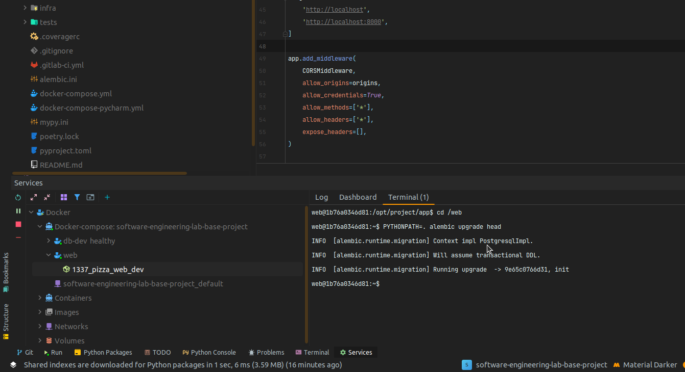

**If your database migration has succeeded, you are done with setting up PyCharm!**

---

# Making changes to the Database Model

Sooner or later you will have to change the database model. 
If you change the database model in your code (see _models.py_), 
you have to change the model in your database, too. 
This is done with a so-called _database migration_ using the tool _alembic_.

Open the folder _app/database/migrations/versions_. 
There you can see all existing migrations. 
At start, you should only see a single file named _xyz_init.py_.

In the PyCharm services, open a terminal in your local web container (_1337_pizza_web_dev_) and 
execute the following command to generate a new migration file:

```bash
cd /web
# you may want to change 'my_new_feature' to something more appropriate
PYTHONPATH=. alembic revision --autogenerate -m "my_new_feature" 
```

This will create a new migration file in _app/database/migrations/versions_. 
Open the file and check whether your changes were correctly detected.

**When working with migrations always remember:**

- After you create a new migration file you have to run the database migration to apply the changes to your database.
  ```
  cd /web
  PYTHONPATH=. alembic upgrade head
  ```

- Do not delete any old migration files in your _app/database/migrations/versions_ folder. 
  The migration files depend on each other.
- Take care that your migration files are consistent in your Git repository. 
  Do not forget to add new migrations to your repo. 
  Watch out for branches with different migration files.

<!-- 
# Starting the app without PyCharm ???? todo - I do not understand this!  !!!

This is not working. After setting up pycharm this container name is in use! 
After removing the container it is starting but the sql container stops again.
/bin/sh: 1: ./scripts/docker-entrypoint.sh: not found


Just open a console windows in the root folder of your project and type

```
docker compose up
```

This will start a postgresql server and the app. Open http://localhost:8000/docs for launching the API Backend through Swagger.

<!--
## Database migration

Before you can really use the API Backend, you need to migrate the database model of the running database container. Open a new terminal window and open an console in the running container:

```
docker exec -it -e PYTHONPATH=. -e API_SERVER=localhost -e API_PORT=8000 1337_pizza_web_dev alembic upgrade head
```

This executes the alembic migration command in the docker container named *1337_pizza_web_dev* with appropriate
environment variables.
-->